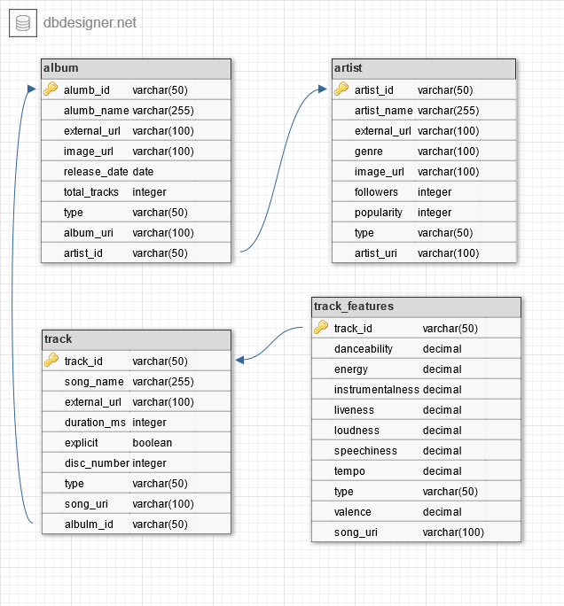

# Project : onramp_project
Project for final interview round of Onramp's Vanguard Data Engineer Apprenticeship 

Original project location at : [https://github.com/sschwartzdata/onramp_project](https://github.com/sschwartzdata/onramp_project)

## Description
Create a data pipeline that extracts, transforms data from Spotify's API using python, and then loads the data into a SQLite database. The database should contain at least 20 artists and 1000 track entries and 5 views. Additionally, three data visualizations will be produced with python which provide some kind of insight.
<br>
This readme contains details on:
1. The environmental and tool setup for the project
2. The project requirements
3. The project structure
4. Pipeline details
  - Pipeline flow
  - How to execute the pipeline

## Setup
Environment Settings
- Local settings need to include
  - `SPOTIPY_CLIENT_ID`
  - `SPOTIPY_CLIENT_SECRET`
  - `SPOTIPY_REDIRECT_URI`
- python version 3.9.7
<br>
Python Packages
- For ETL pipeline
  - `spotipy` version 2.20.0
  - `spotipy.oauth2` version 2.20.0
  - `pandas` version 1.3.5
  - `sqlite3` version 3.37.0
- For Visualizations
  -   `matplotlib` version 3.5.0
  -   `seaborn` version 0.11.2


## Project Requirements
Data requirements:
- [x] 20 artists of my choice
- [x] atleast 1000 rows of track data

Process
- [x] Extract and transform data from spotify
- [x] Create required tables in SQLite database
- [x] Load data into database
- [x] Create 3 required views
- [x] Create 2 other views
- [X] Create 3 data visualization


Deliverables
- [x] Python Code for ETL pipeline
- [x] spotify.db file
  - [x] 5 views
- [x] pdf with 3 data visualizations

## Database structure
The database contains four dimentional tables as shown in the Entity Relational Diagram below.




## Project file structure


``` bash
.
├── Submissions                 # Test files (alternatively `spec` or `tests`)
│   ├── etl.py                  # Script to Extract, Transform and Load the data
│   ├── proof_of_concept.ipynb  # Documents the thought process for building the pipeline
│   ├── classes                 # Contains all custom classes used in etl.py
|   |   ├── data_pull.py                      # Test files (alternatively `spec` or `tests`)
|   |   ├── db_connection.py                  # Test files (alternatively `spec` or `tests`)
│   ├── db_files                # Contains final database file
|   |   ├── spotify.db                        # SQLite Spotify database files
│   ├── helper_functions        # Contains all custom functions and sql queries used in etl.py
|   |   ├── db_views.py                       # Contains the function used to create the views in spotify.db
|   |   ├── load.py                           # Contains the function used to load data into spotify.db
|   |   ├── sql_queries.py                    # Contains all SQL queries for the project
│   ├── images        # Contains all data visualizations and ERD
|   |   ├── Visualizations.pdf                # PDF containing visualizations and descriptions
|   |   ├── Visualizations.pptx               # PPT containing visualizations and descriptions
|   |   ├── erd.png                           # Entity Relational Diagram for database
|   |   ├── features_correlation_heatmap.png  # Heatmap visualizations for correlation of track features
|   |   ├── features_pairplot.png             # scatter plot visualizations for correlation of track features
|   |   ├── features_violin.png               # Violin plots for select track features
│   └── test                    # Unit and data validation tests
|   |   ├── null_duplicate.py                 # Checks for null in duplicated records in all dataframes
└── ...

```


## ELT Pipeline
Extract, transform, load (ETL) is the general procedure of copying data from one or more sources into a destination system which represents the data differently from, or in a different context than, the sources.

### Extracting, Transforming, and Loading the Data

The ETL pipeline extracts data from Spotify's API four times using the package spotipy. The flow of the ETL pipeline is:
- Extract
  - Use personally selected artist to pull all required information about each artist
    -  Create a list of the artist's ids
  - Use artist id list to pull all albums created by each artist
  - Remove duplicate albums including remixes and region variants
    -  Create a list of the album's ids
  - Use cleaned list of album ids to pull information for all tracks on each album
    - Create a list of the track's ids
  - Use list of track ids to pull all track feature information
- Transform
- Load
  - Create a connection to the database
  - Drop tables if they exist
  - Create tables
  - use `load.py` to load data into spotify.py
- Analysis
  - Create views in spotipy.db using `create_view.py`
  - Create data visualizations using matplotlib and seaborn packages


Running the the ELT pipeline:
- Insure the following python packages are installed
  -   `spotipy`
  -   `spotipy.oauth2`
  -   `pandas`
  -   `sqlite3`
  -   `matplotlib`
  -   `seaborn`
- Insure that you have a developer account with Spotify and you have the following environmental settings defined on your local computer
  - `SPOTIPY_CLIENT_ID`
  - `SPOTIPY_CLIENT_SECRET`
  - `SPOTIPY_REDIRECT_URI`
- Run `python etl.py`
    - Data will be extracted from the Spotify's API files and transformed and loaded into the spotipy.db
    - Views will also be created in spotify.db
